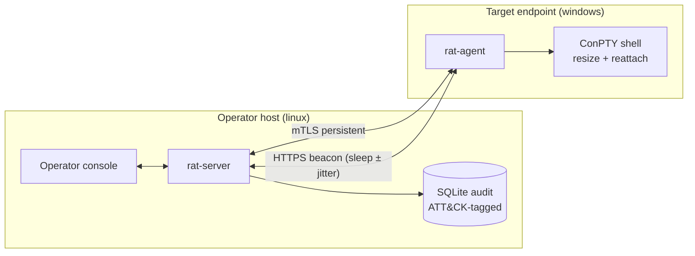

# go-c2-framework

**A command-and-control platform engineered together with its own
detection coverage** — protocol, server, endpoint component and
operator console on one side; Sigma rules, a reference Sysmon
deployment, ATT&CK mappings and validation scenarios on the other.
Every detection in this repository was validated live against real
Windows endpoint telemetry, with the platform's own audit log as ground
truth.

> This is a portfolio repository: it documents the system and ships the
> full detection-engineering content, without implementation source.
> The codebase is private by design (dual-use security tooling) and is
> available for review on request.

## Why this is interesting

Most C2 projects answer "what can it do to a host". This one also
answers "what does doing it look like to defenders" — with the same
engineering rigor on both sides:

- The **wire protocol** (v2.1) was designed before the first agent
  existed: a frame-type discriminator so control messages and binary
  transfer data share one stream unambiguously, a **direction ACL
  enforced on both read and write**, per-connection sequence numbers
  against replay, and a ±30 s freshness window.
- **Two layers of authentication** — mutual TLS 1.3 (CA-pinned,
  client certificates) plus a PSK challenge–response with an
  HKDF-derived HMAC and an independent domain for session resume.
  Rejection responses are uniform by design: no error oracle for
  enumerating client IDs.
- **Session ≠ connection** — tasks to a disconnected session queue
  server-side (bounded, TTL-capped) and dispatch on the next check-in;
  the HTTPS beacon transport (sleep ± jitter) gets the same operator
  workflow as the persistent mTLS transport.
- **Resumable, checksummed transfers** — per-transfer state machine,
  disk spooling, chunk acknowledgment, SHA-256 verification, resume
  from the last confirmed chunk after a mid-transfer disconnect.
- **Graceful shutdown** — agents are notified and drain; a deliberate
  shutdown is distinguished from a dropped connection (exit vs.
  reconnect-with-backoff).
- **ATT&CK-tagged audit** of every session, task and transfer — this
  log is the *ground truth* the detection layer is scored against, so
  coverage is measured, never assumed.

## Architecture



Full design — protocol, authentication, transports, server internals,
endpoint component, audit: **[docs/architecture.md](docs/architecture.md)**.
Adversaries, assets and the honest "defender's view" half:
**[docs/threat-model.md](docs/threat-model.md)**.

## Detection engineering

The shipped content is real and usable, not illustrative:

- **13 Sigma rules** — including a Sigma 2.0 **temporal correlation**
  for beacon periodicity and lineage rules for the endpoint process
  tree (`agent → shell`), the headless ConPTY host, transfer spool
  naming, and a debugger-attach rule for the T1622 checks.
- **Reference Sysmon config** hardened by live canary findings
  (documented Sysmon 15.21 quirks: the `<Hashes>` element fast-fails;
  HKCU writes render as `HKU\<SID>\…` and defeat naive patterns).
- **ATT&CK mappings** in three tiers — framework-native,
  scenario-backed, and *documented — not exercised* for the families
  whose artifacts cannot be reproduced without implementing the
  technique.
- **13 detection playbooks** with honest visibility boundaries: what
  classic endpoint telemetry sees, what only EDR/ETW-TI memory
  analytics can see, and the false-positive profile of each rule.
- **A validated coverage report** — scenarios executed against a real
  Windows 11 host (Sysmon 15.21), detections reconciled against the
  audit log: [scenarios/COVERAGE-2026-09-02.md](scenarios/COVERAGE-2026-09-02.md).

Example — the beacon periodicity correlation (abridged):

```yaml
correlation:
  type: temporal
  rules: [ <base rule: agent outbound connection> ]
  group-by: [Image]
  timespan: 10m
  count: 8
```

Methodology and validation results:
**[docs/detection-engineering.md](docs/detection-engineering.md)** ·
mappings: [detections/mappings.yaml](detections/mappings.yaml) ·
rules: [detections/sigma/](detections/sigma/) ·
runbooks: [detections/playbooks/](detections/playbooks/) ·
scenario index: [scenarios/INDEX.md](scenarios/INDEX.md)

## Testing

Protocol unit tests including mixed-stream framing regression; real
agent against real server end-to-end (auth classes, resume, offline
queue, interrupted transfers); the whole suite race-detector-clean in
CI; a native fuzz target over the frame reader with a committed seed
corpus; and live range validation as the final layer. Several tests
exist because a real bug earned them — the ping-cycle poisoning
regression and the shutdown-drain deadlock guard are documented in
**[docs/testing.md](docs/testing.md)**.

## Scope

The implant implements operational capabilities only; defense
subversion (AMSI/ETW patching, unhooking, syscalls, sleep
obfuscation, injection, packing) is deliberately absent and covered as
*detection material* instead. One documented exception — T1622
debugger checks, read-only OS state queries — ships with its own
detection rule, playbook and validation tooling. Full statement:
**[docs/scope.md](docs/scope.md)**.

## Repository layout

```
docs/          architecture · threat model · detection engineering · testing · scope
detections/    mappings.yaml · sigma/ (13 rules) · playbooks/ (13) · sysmon/
scenarios/     12 ATT&CK-referenced procedure runbooks + live coverage report
```

## Responsible use

Authorized security research and lab environments only. The detection
content is published for defenders. No binaries are built or
distributed by any pipeline of this repository.
