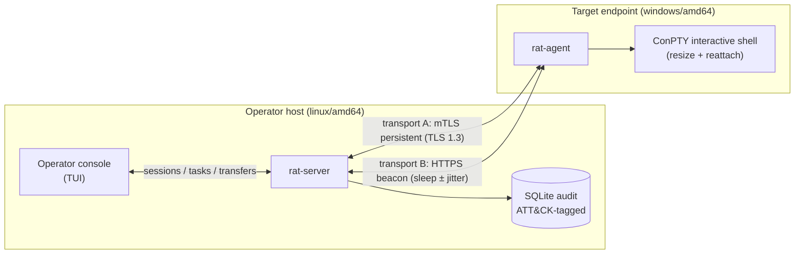

# Architecture

High-level design of the platform. The implementation is private; this
document describes the system as built and live-validated.

## Components



- **rat-server** — listener, authentication, task/transfer orchestration,
  operator console, audit persistence. Targets linux/amd64.
- **rat-agent** — endpoint component: command execution, chunked file
  transfer with resume, interactive ConPTY shell, reconnect/resume,
  periodic debugger checks (T1622). Targets windows/amd64 only.
- **Operator console** — interactive TUI: sessions, exec, transfers,
  live shell with backgrounding/reattach, task history, ATT&CK coverage
  report rendered from the audit log, broadcast exec.
- **Detection layer** (this repository's centerpiece) — Sigma rules,
  Sysmon reference config, per-technique playbooks, ATT&CK mappings and
  emulation scenarios; see
  [detection-engineering.md](detection-engineering.md).

## Wire protocol (v2.1)

Length-prefixed frames with a 1-byte **frame-type discriminator**:

```
[4B length][1B type][payload]     0x01 = JSON message
                                   0x02 = binary chunk (transfer data)
```

The discriminator is load-bearing: control messages and binary transfer
data share one stream and a reader never has to guess which is next —
a mixed stream (JSON → chunk → JSON interleaved) parses deterministically.

Message-level guarantees:

- **Direction ACL** — every message type has an allowed sender role
  (server or client). The ACL is enforced on **both** the read and the
  write path; a component cannot emit or accept a message outside its
  role, by accident or otherwise.
- **Replay protection** — per-connection monotonic sequence numbers;
  out-of-order or repeated frames are rejected.
- **Freshness window** — message timestamps validated against a ±30 s
  window; clock skew beyond that fails authentication deterministically.
- **Size caps** — hard frame size limit protects the reader from
  hostile peers; bulk data rides chunked frames instead.

## Authentication

Two layers, both required:

1. **Mutual TLS** — TLS 1.3 minimum, server certificate pinned to a
   dedicated CA at the client, client certificates required and
   CA-verified at the server. No hostname reliance.
2. **PSK challenge–response** — after the TLS handshake the server
   issues a random challenge; the client answers with an HMAC keyed by
   an HKDF-SHA256-derived key (separator-safe construction). Session
   resume uses an independent HMAC domain, so a resumed connection
   cannot be forged with handshake material.

Auth failure responses are **deliberately uniform** — every rejection
(unknown client, wrong PSK, expired challenge, exceeded attempts)
returns the same error to the peer; the specific reason is logged
server-side only. This removes the error oracle an attacker would
otherwise use to enumerate valid client IDs.

## Transports

| | mTLS persistent | HTTPS beacon |
|---|---|---|
| Shape | one long-lived TLS session | short poll per cycle |
| Cadence | interactive, bursty | `sleep ± jitter%` (default 30 s ± 20%) |
| Best for | live shell, transfers | egress-constrained networks |
| Liveness | server ping loop (interval + timeout, RTT on session) | poll presence itself |
| Transfers | both directions, resumable | download only (chunks ride the next poll's uplink); uploads require a live connection and are rejected explicitly |

The key design property: **session ≠ connection**. Tasks addressed to a
disconnected session accumulate in a bounded, TTL-capped server-side
queue and dispatch on the next check-in — a beacon agent cycling
connect/sleep still receives the full operator workflow. Dropped
persistent connections keep their session record until timeout, so
reconnect/resume (with the same session identity) is seamless.

## Server internals

- **Handler-registry dispatch** — `map[message type]handler`; unknown
  types are logged and dropped, never fatal to the session. Protocol
  violations (bad frame, direction breach, sequence regression) close
  the connection; semantic errors get an error message back.
- **Task registry** — command-ID correlation, timeouts, streaming
  output reassembly, completion signaling for the console.
- **Transfer manager** — per-transfer state machine in both directions:
  disk spooling, chunk acknowledgment bookkeeping, SHA-256 verification
  on completion, resume-after-disconnect from the last confirmed chunk.
- **Graceful shutdown** — `Stop()` notifies connected agents
  (`server_shutdown`), drains in-flight transfers with a bounded wait,
  flushes logs. Agents distinguish a deliberate shutdown (exit cleanly,
  do not reconnect) from a dropped connection (reconnect with backoff).
- **Abuse controls** — per-IP connection rate limiting, max-client
  cap, bounded pending authentications; failed authentications never
  leave session records behind.

## Endpoint component

- **Exec** — server-issued commands run under the agent with
  shell selection reported by the endpoint at check-in (capability
  inversion: the endpoint declares what it has, the operator chooses).
- **Transfers** — spool-then-atomic-rename on upload; hashed chunked
  streaming on download; resume support mirrors the server side.
- **Interactive shell** — Windows pseudoconsole (ConPTY) with live
  resize from the operator terminal, shell backgrounding and reattach
  with process/cwd state intact, and a VT sanitizer that keeps
  full-screen repaints readable in a scrolling console. Non-Windows
  fallback is a piped shell.
- **Debugger checks (T1622)** — the single evasion-family feature in
  the implant; read-only OS state queries (see
  [scope.md](scope.md)).
- **Silent operation** — release builds are GUI-subsystem: no console
  window, no local log files.

## Audit and ground truth

Every session, task and transfer is persisted to SQLite (pure-Go,
CGO-free) with **ATT&CK technique tags** (command execution → T1059,
download → T1005, upload → T1105, debugger checks → T1622). Persistence
never sits in the data path — a store failure degrades the audit trail,
not the operation. This audit log is the ground truth the detection
layer is validated against: an engagement replay shows exactly which
techniques ran, with timestamps, to be reconciled against what the
endpoint telemetry actually saw.
